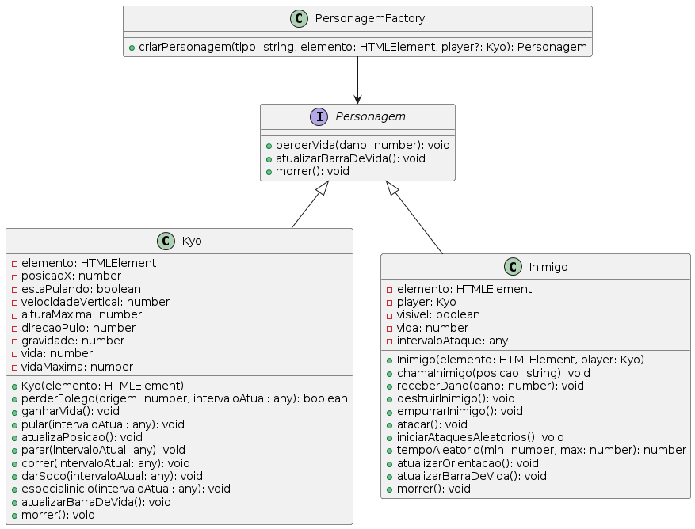
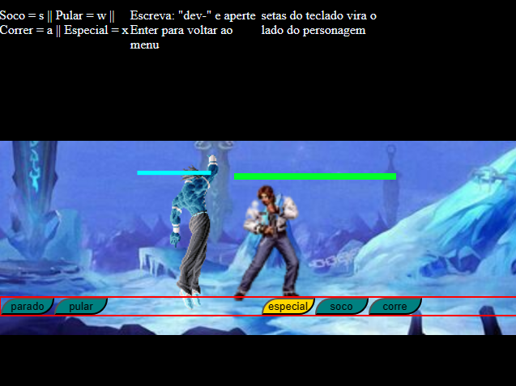

# Jogo de Ação Sprite
## Descrição
Este repositório contém um projeto de jogo embrionário desenvolvido como parte de um exercício para treinar técnicas avançadas de manipulação do DOM e uso eficiente de imagens sprite em um contexto de desenvolvimento web. O jogo utiliza uma série de técnicas modernas de JavaScript e CSS para criar uma experiência interativa baseada em sprites animados.

## Tecnologias Utilizadas
HTML5: Estrutura base do jogo.
CSS3: Estilização e animações dos sprites.
JavaScript: Lógica de jogo, manipulação do DOM e modularização com classes.
Características
O projeto foca no uso de imagens sprite para a animação de personagens e outros elementos do jogo. Além disso, é feito uso intensivo do DOM para criar interações dinâmicas, como a detecção de colisões e a atualização de estados do jogo.

## Uso de Classes para Modularização
O código é organizado em várias classes para encapsular diferentes aspectos do jogo:




- Kyo: Classe que gerencia o personagem principal, incluindo suas animações e interações, como correr, pular e atacar.
- Inimigo: Classe responsável por controlar os inimigos, incluindo sua aparição, animação e lógica de dano.
- Cenario: Classe que gerencia o cenário do jogo, controlando aspectos como a mudança de fundos e a interação com o cenário.
- Menu: Classe que lida com a interface de usuário inicial e as opções de jogo, permitindo ao jogador iniciar o jogo e ajustar configurações como a velocidade e a gravidade.
## Funcionalidades de Interatividade
O jogo implementa funcionalidades interativas avançadas, como:

- Detecção de Colisões: Uso de getBoundingClientRect() para detectar interações entre o personagem principal e os inimigos.
- Controle de Animação: Manipulação de background positions para animar sprites baseando-se em uma série de imagens contidas em um único arquivo.
Ajuste Dinâmico de Configurações: Utilização de elementos de interface como sliders para ajustar configurações do jogo em tempo real.
## Como Executar
Para executar o jogo, clone o repositório e abra o arquivo index.html em um navegador moderno que suporte JavaScript e HTML5.

```
git clone https://github.com/faustinopsy/game-sprites.git
cd game-sprites
open index.html 
# ou use seu navegador para abrir o arquivo
```
## Contribuições
Contribuições são bem-vindas, especialmente na expansão das funcionalidades do jogo, melhorias na lógica de colisão, ou na otimização das animações dos sprites.